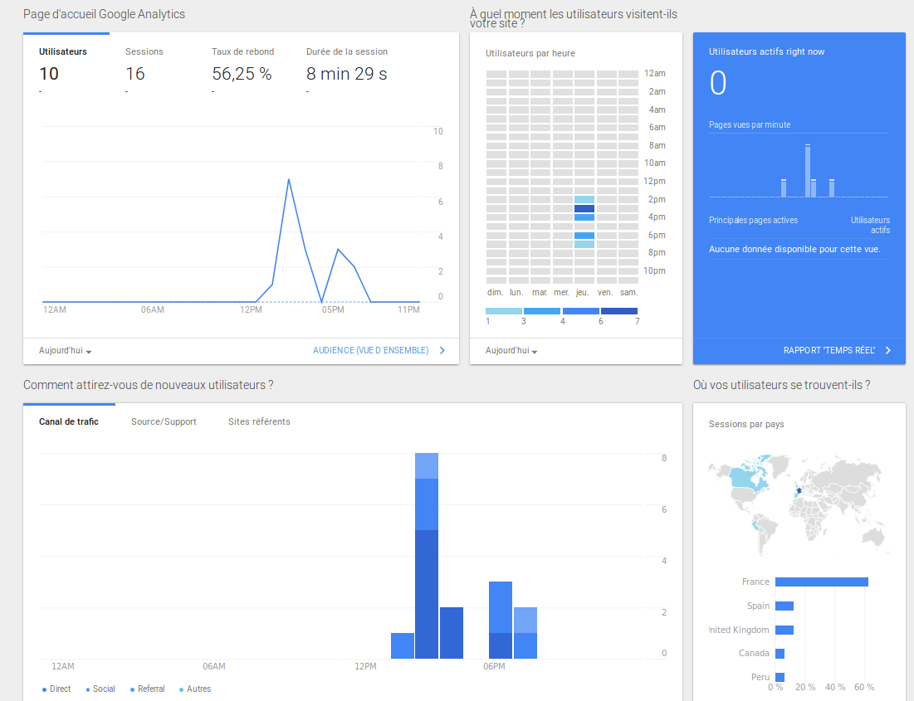

# Week n°6 on Day n°4 - THP - Team BDX - (kings-)Landing Page of The Hacking Project

## Projet du jour :

  Le projet du jour consiste a construire une landing page fonctionnelle en production faisant la promotion de The Hacking Project. Pour cela, nous nous sommes déployés en méthode dite "Agile" (oui, à deux ...) et également en méthode dite "flex" (du à nos nombreuses années passées à faire du twirling-bâton). Aujourd'hui, 12 litres de café ont été engloutis, 4 stages en asile psychiatrique nous ont été offerts par les voisins ainsi que notre mentor a su nous motiver comme jamais avec des vidéos de Q...ualité :D. L'équipe est composée de 2 personnes (oui, à plus de un, c'est une équipe :D) : Mister Bab et Seur Massimo.

## Pré-requis et installation :

1 - Veuillez svp, vous relever de votre PLS.

2 - Pour le fun, vous pouvez cloner ce repo sur votre machine avec la commande suivante (le dossier créé s'appelera "W6D4_TeamBDX_LandingPage") :
```
  $ git clone https://github.com/iMassim0/W6D4_TeamBDX_LandingPage
```

3 - Se rendre dans le dossier et enjoy !

## Objectif & Volontés :

### Volontés de l'équipe :

  D'après le sujet, nous avons souhaité avoir une landing page simple, efficace, stylée et facile à dérouler. Pour cela, nous avons utilisé une méthode js sexy trouvée sur les internets mondiaux. Pour pouvoir mesurer l'audience et l'efficacité de cette landing page, nous avons implanter en son sein le service Google Analytics. Notament, nous avons mesuré une efficacité ou nous sommes non peu-fier d'afficher 20 visites sur un créneau d'une après-midi, et ce depuis le Canada, l'espagne, le Royaume-Uni, mais surtout le Pérou (#redirections). Egalement, une redirection de souscription à une newsletter à été créée, pour ne pas perdre de précieux futurs moussaillons.

  Pour résumer :

    - Versionning : Git & gitHub
    - Structure   : HTML classique avec JS/CSS/IMG associés (Rails semaine pro OKLM)
    - EDI         : Atom
    - Hébergeur   : gitHub Pages
    - Services    : Google Analytics && MailChimp && Balises Open Graph

### Déroulement :

Pour le sujet du jour, nous avons procéder de cette manière :

  9h - 10h      : Café - Briefing - Café - Organisation de la journée - Café - Café

  10h - 12h30   : Recherches && lectures && documentations && choix des outils/design/hébergeur/etc.

  12h30 - 13h   : Déjeuner expéditif à base de carottes

  13h - 16h30   : Lancement des hostilités et rédaction pure

     16h32      : Pétage de plomb et choix d'un autre désign #désoPaDéso

  16h33 - 19h30 : Développement && code && implantation && déploiement && peaufinage

  19h30 - 20h00 : Last push && finalisation du joli Readme des familles

### Focus sur Google Analytics : Révélation de la journée

  Quel outil fantastique qu'est Google Analytics ! Révélation pour les bons vieux acolytes bab&max ... Petit aperçu du panneau de contrôle de l'application :
  <p align="center">
    
  </p>

## Contributeur

@bab - Baptiste ROGEON

@massimo - Maxime FLEURY

<p align="center">
  
</p>
